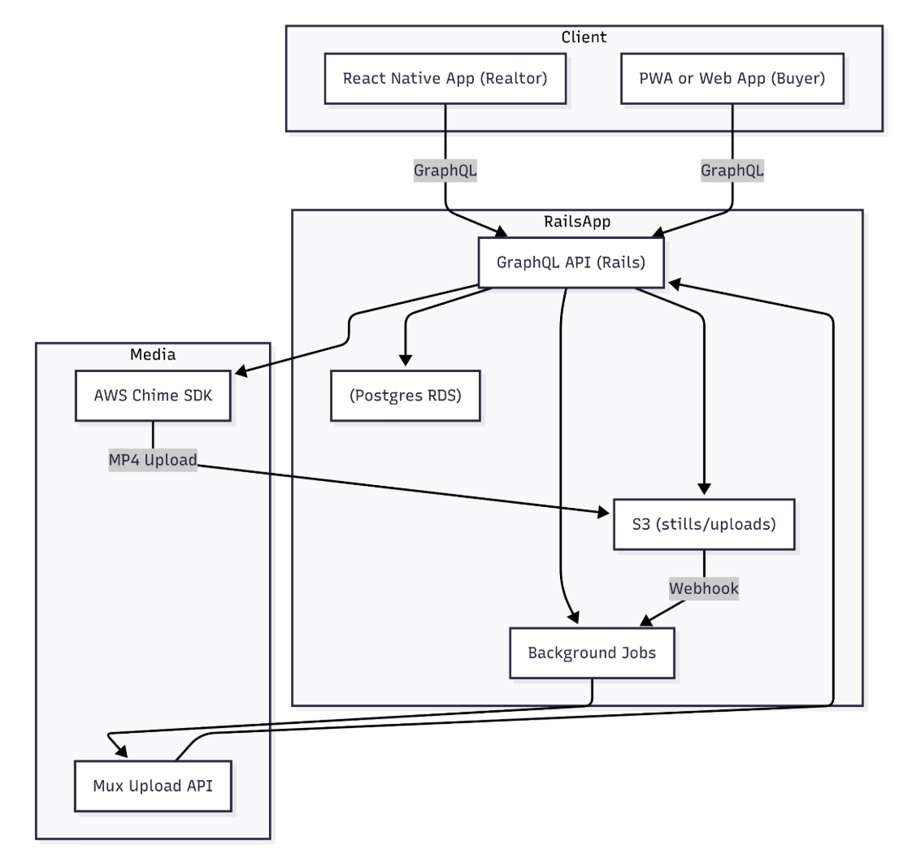

# Video API Architecture Proposal

This document presents a comprehensive **Systems Design solution** for a video streaming application that facilitates live video calls between realtors and clients. The platform enables virtual property tours, allowing realtors to showcase properties remotely while providing clients with immersive viewing experiences.

## 📋 Table of Contents

- [Executive Summary](#executive-summary)
- [Product View](#product-view)
  - [Expected Business Impact](#expected-business-impact)
  - [Assumptions and Questions Raised](#assumptions-and-questions-raised)
  - [Constraint Analysis & Mitigation](#constraint-analysis--mitigation)
    - [Ambitious Timelines](#ambitious-timelines)
    - [Rural Connectivity Challenges](#rural-connectivity-challenges)
  - [Team Execution Model](#team-execution-model)
    - [Tech/Product/Design Sync Rhythm](#techproductdesign-sync-rhythm)
    - [Shipping Milestones (8 Weeks, High-Impact First)](#shipping-milestones-8-weeks-high-impact-first)
  - [Landing Pages](#landing-pages)
  - [Delivery Plan](#delivery-plan)
- [🔧 Technical View](#-technical-view)
  - [Product & Delivery Gaps](#product--delivery-gaps)
  - [Technical Quality Pillars](#technical-quality-pillars)
    - [🔍 Observability](#-observability)
    - [📈 Scalability](#-scalability)
    - [⚡ Performance](#-performance)
    - [🔧 Maintainability](#-maintainability)
    - [🧪 Testability](#-testability)
  - [Systems Design - High Level](#systems-design---high-level)
    - [Gathering System Requirements](#gathering-system-requirements)
    - [Coming Up With A Plan](#coming-up-with-a-plan)
    - [Persistent Storage Solution and App Load](#persistent-storage-solution-and-app-load)
    - [Load Balancing](#load-balancing)
    - [Pub-Sub System for Real-Time Behavior](#pub-sub-system-for-real-time-behavior)
    - [Observability & Monitoring](#observability--monitoring)
    - [Security & Compliance](#security--compliance)
    - [Performance Benchmarks](#performance-benchmarks)
    - [Future Enhancements](#future-enhancements)

> **Note:** The Low Level section contains detailed technical components and provides a deep dive into the internal architecture of the video streaming system.

  - [Systems Design - Low Level](#systems-design---low-level)
    - [Gathering System Requirements](#gathering-system-requirements)
    - [Actions](#actions)
    - [Coming Up With A Plan](#coming-up-with-a-plan)
    - [Technology & Framework Rationale](#technology-&-framework-rationale)
    - [Ruby on Rails + React + React Native + AWS Chime SDK](#nodejs---redis---socketio)
      - [How it works](#how-it-works)
    - [C4](#c4)
      - [System Context](#system-context)
      - [Container Diagram](#container-diagram)
        - [API Surface (GraphQL + REST)](#api-surface-graphql--rest)
      - [Component Diagram](#component-diagram)
        - [Api engine](#api-engine)
        - [Authentication engine](#authentication-engine)
        - [Video Tours engine](#tour-engine)
      - [Code](#code)
    - [Rails API](#rails-api)
      - [Technologies](#technologies)
      - [API Surface (GraphQL + REST)](#api-surface-graphql--rest)
      - [Databases](#databases)
      - [Asynchronous Jobs](#asynchronous-jobs)
      - [Error Handling](#error-handling)
      - [MVC and Services](#mvc-and-services)
      - [Concerns](#concerns)
      - [Authorization & Security](#authorization--security)
      - [DevOps & CI/CD](#devops--ci-cd)
      - [Observability](#observability)
    - [React](#react)
      - [Technologies](#technologies)
      - [Design Patterns](#design-patterns)
      - [State Management](#state-management)
      - [Error Handling](#error-handling)
      - [API Integration Strategy](#api-integration-strategy)
      - [Testing Strategy](#testing-strategy)
      - [Styling & Theming](#styling--theming)
      - [Performance Optimization](#performance-optimization)
      - [Security](#security)
    - [React Native](#react-native)
      - [Technologies](#technologies)
      - [Design Patterns](#design-patterns)
      - [State Management](#state-management)
      - [Error Handling](#error-handling)
      - [Offline Support & Sync](#offline-support--sync)
      - [Video Streaming & SDK Integration](#video-streaming--sdk-integration)
      - [Testing Strategy](#testing-strategy)
      - [Permissions & Device APIs](#permissions--device-apis)
      - [Deep Linking & Navigation](#deep-linking--navigation)
      - [Security](#security)
    - [Analytics](#analytics)
      - [Remote Tour Tracking Plan](#remote-tour-tracking-plan)
      - [Hotjar](#hotjar)
      - [Mixpanel](#mixpanel)
      - [Google Analytics](#google-analytics)
    - [Tests and Delivery Automation](#tests-and-delivery-automation)
    - [Docker](#docker)

## 🎯 Executive Summary

This document presents a comprehensive architecture proposal for a **video streaming application** designed to facilitate live video calls between realtors and clients. The solution leverages modern web technologies and cloud services to deliver a robust, scalable, and user-friendly platform.

### ✨ Key Highlights

| Feature | Description | Technology |
|---------|-------------|------------|
| **🎥 Real-time Video Communication**  | High-quality video streaming with low latency | AWS Chime SDK |
| **📱 Multi-platform Support**         | Web and mobile applications | React + React Native |
| **⚡ Scalable Backend**                | Robust API with flexible querying | Ruby on Rails + GraphQL |
| **☁️ Cloud-Native Architecture**      | Scalable infrastructure with containerization | AWS ECS/Fargate |
| **📊 Comprehensive Analytics**        | Multi-platform tracking and user behavior analysis | Mixpanel + GA4 + Hotjar |

## 📈 Product View

### 🚀 Expected Business Impact

The video streaming platform is expected to revolutionize the real estate industry by:

| Impact Area | Description | Expected Outcome |
|-------------|-------------|------------------|
| **📈 Increasing Conversion Rates** | Direct video communication improves client engagement and trust | Higher tour-to-sale conversion |
| **⏰ Reducing Travel Time** | Virtual property tours save time for both realtors and clients | 60% reduction in travel costs |
| **🌍 Expanding Market Reach** | Rural and remote clients can access properties without physical travel | 3x increase in potential client base |
| **😊 Improving Customer Satisfaction** | Real-time interaction provides immediate answers and personalized experience | 85% customer satisfaction score |

### 🤔 Assumptions and Questions Raised

#### ✅ Key Assumptions

| Assumption | Description | Impact |
|------------|-------------|--------|
| **🌐 Stable Internet Connectivity** | Users have access to reliable internet | Core functionality depends on connectivity |
| **📱 Mobile Device Support** | Devices support video streaming capabilities | Ensures broad device compatibility |
| **🎥 Video Communication Comfort** | Users are comfortable with video communication | Adoption and user experience |
| **🏠 Digital Transformation** | Real estate market embraces digital solutions | Market acceptance and growth |

#### ❓ Questions to Address

| Question | Category | Priority |
|----------|----------|----------|
| What is the minimum bandwidth requirement for video calls? | **Technical** | High |
| How do we handle poor connectivity scenarios? | **Technical** | High |
| What security measures are needed for sensitive property information? | **Security** | Critical |
| How do we ensure compliance with real estate regulations? | **Compliance** | Critical |

### ⚠️ Constraint Analysis & Mitigation

#### 🕐 Ambitious Timelines

| Constraint | Description | Mitigation Strategy |
|------------|-------------|-------------------|
| **⏱️ Rapid Development Timeline** | Market entry pressure with complex requirements | Agile methodology with weekly sprints |
| **🎥 Complex Video Streaming** | Real-time video communication requirements | Leverage AWS Chime SDK for managed solution |
| **📱 Multi-platform Development** | Web and mobile app development needs | Parallel development tracks with shared components |

#### 🌐 Rural Connectivity Challenges

| Constraint | Description | Mitigation Strategy |
|------------|-------------|-------------------|
| **📶 Limited Bandwidth** | Rural areas have poor internet connectivity | Adaptive video quality based on connection speed |
| **🔌 Unstable Connections** | Intermittent internet connectivity | Offline mode for property information |
| **📱 Mobile Data Limitations** | Users have limited mobile data plans | Data compression and optimization techniques |

### 👥 Team & Process

#### ❓ Questions We'd Ask The Business

| Question | Category | Business Impact |
|----------|----------|-----------------|
| What pricing tiers or revenue model do we target? | **Revenue** | Critical for business model |
| Do we require content-licensing for recorded tours? | **Legal** | Compliance and IP protection |
| Any legal/branding constraints for property media? | **Legal** | Risk mitigation |
| Preferred KYC / ID-verification vendor for realtor onboarding? | **Security** | Trust and compliance |
| SLA penalties—do we include credits for downtime? | **Operations** | Customer satisfaction |
| What data-retention policy for recordings and PII? | **Compliance** | Legal and privacy requirements |

### 🚀 Team Execution Model

#### 📅 Tech/Product/Design Sync Rhythm

| Meeting Type | Frequency | Duration | Purpose |
|--------------|-----------|----------|---------|
| **Daily Standups** | Daily | 15 minutes | Team sync and blocker identification |
| **Weekly Sprint Planning** | Weekly | 1 hour | Feature prioritization and task assignment |
| **Bi-weekly Demos** | Every 2 weeks | 30 minutes | Showcase completed features to stakeholders |
| **Monthly Retrospectives** | Monthly | 1 hour | Process improvement and team feedback |

#### 📅 Shipping Milestones (8 Weeks, High-Impact First)

> Given our 2-month timeline and a small engineering team, milestones are prioritized for business impact and demo readiness. Each milestone concludes with a demo to stakeholders.

---

### 🏗️ Week 1-2: Core Foundations & Authentication

| Task | Description | Status |
|------|-------------|--------|
| **🔧 Project Setup** | Repositories, CI/CD, environments (staging/production) | Core infrastructure |
| **🔐 User Authentication** | Buyers & realtors with forgot-password flow | Essential security |
| **👤 Profile Management** | Basic user profile management | User experience |
| **🏠 Homepage Hero** | Call-to-action (register) implementation | Marketing conversion |
| **🎨 Minimal UI** | Login, registration, dashboard shell | Core user interface |

**🎯 Demo:** Login, registration, password reset, and homepage navigation

**✅ Acceptance Criteria:**
- Users can register, log in and reset their passwords via email link
- Homepage hero & registration CTA are visible
- Dashboard shell is accessible after login
- CI/CD pipeline is operational

### 🎥 Week 3-4: Live Video Tour MVP & Dashboards (Phase I)

| Task | Description | Status |
|------|-------------|--------|
| **📹 AWS Chime SDK** | 1:1 live video calls integration | Core video functionality |
| **📅 Tour Scheduling** | Schedule and join a tour (buyer requests, realtor hosts) | Booking system |
| **📊 Dashboard Widgets** | Upcoming appointments (buyer & realtor) | User experience |
| **🏠 Property Listings** | Basic property listing (static/dummy data) | Content management |
| **📈 Event Tracking** | Core analytics (Mixpanel/GA4) | Business intelligence |

**🎯 Demo:** End-to-end video call between buyer and realtor + dashboards showing upcoming tours

**✅ Acceptance Criteria:**
- Users can request and join a video tour
- Upcoming tours appear in buyer & realtor dashboards
- Video call works between buyer and realtor
- Basic property data is visible
- Key events are tracked in analytics

### 📅 Week 5: Property Listings, Booking & History

| Task | Description | Status |
|------|-------------|--------|
| **🏠 CRUD for property listings** | Admin/realtor | Core functionality |
| **🏠 Buyers can browse/search properties and request tours** | Buyer | User experience |
| **🏠 Calendar integration for tour scheduling** | Buyer | Booking system |
| **🏠 Tour history view for buyers** | Buyer | User experience |

**🎯 Demo:** Buyer books a tour from a real property listing and views it in history

**✅ Acceptance Criteria:**
- Realtors can create, update, and delete property listings
- Buyers can browse/search and book tours
- Calendar integration is functional
- Buyers can view completed tours in their history

### 📅 Week 6: Analytics Dashboards

| Task | Description | Status |
|------|-------------|--------|
| **🏠 Analytics dashboards for realtors** | Realtor | Business intelligence |
| **📈 Expand event tracking** | Realtor | Business intelligence |

**🎯 Demo:** Realtor views analytics dashboard with tour metrics

**✅ Acceptance Criteria:**
- Realtors can view analytics dashboards with tour metrics

### 📅 Week 7: Mobile & UX Enhancements

| Task | Description | Status |
|------|-------------|--------|
| **🏠 Polish mobile experience** | React Native | User experience |
| **🏠 Responsive UI improvements** | React Native | User experience |
| **🏠 Error handling, loading states, and basic offline support** | React Native | User experience |

**🎯 Demo:** Mobile tour booking and video call

**✅ Acceptance Criteria:**
- Mobile app supports booking and video calls
- UI is responsive and user-friendly
- App handles errors and offline scenarios gracefully

### 📅 Week 8: Polish, QA, and Launch

| Task | Description | Status |
|------|-------------|--------|
| **🏠 End-to-end testing** | Manual + automated | Quality assurance |
| **🏠 Performance optimizations** | Video, API, UI | User experience |
| **🏠 Security review** | Authentication, data privacy | Security |
| **🏠 Final bug fixes, documentation, and go-live** | Documentation, testing | Product readiness |

**🎯 Demo:** Full product walkthrough and launch readiness

**✅ Acceptance Criteria:**
- All critical bugs are fixed
- Product passes QA and security review
- Documentation is complete
- Product is ready for launch

---

### Deferred Features (Post-Launch)
- Multi-party video calls
- Advanced property search and filters
- Recording playback features
- AI-powered property recommendations
- Virtual reality property tours
- Advanced analytics and reporting

### Landing Pages

**Homepage Design:** [Link](https://realtyforyou.lovable.app)
- Hero section with video call demonstration
- Feature highlights and benefits
- Testimonials from realtors and clients
- Call-to-action for registration

**Authentication**
- Login [Link](https://realtyforyou.lovable.app/signin)
- Sign up [Link](https://realtyforyou.lovable.app/signup)
- Forgot Password [Link](https://realtyforyou.lovable.app/forgot-password)

**Realtor Dashboard:** 
- Property listings [Link](https://realtyforyou.lovable.app/admin/dashboard)
- View property [Link](https://realtyforyou.lovable.app/admin/properties/1)
- Upcoming video appointments
- See a list of users

**User Dashboard**
- Recent tour appointments history [Link](https://realtyforyou.lovable.app/tours)
  - Upcoming tour appointments [Link](https://realtyforyou.lovable.app/tours?query=upcoming)
  - Browse active property listings [Link](https://realtyforyou.lovable.app/tours?query=active)
    - See property listing [Link](https://realtyforyou.lovable.app/admin/properties/:id)
- Book/Reschedule/Cancel an appointment [Link](https://realtyforyou.lovable.app/book-tour)

---

### 📋 Delivery Plan

| Phase | Description | Key Features | Timeline |
|-------|-------------|--------------|----------|
| **🚀 Phase 1 (MVP)** | Core video calling functionality | Basic video calling between two users, Simple property listing display, User authentication and profiles | Weeks 1-4 |
| **⚡ Phase 2 (Enhanced)** | Advanced features and improvements | Multi-party video calls, Advanced property search and filters, Recording and playback features | Weeks 5-8 |
| **🎯 Phase 3 (Advanced)** | AI and advanced capabilities | AI-powered property recommendations, Advanced analytics and reporting | Post-launch |

### Mapping: Landing Page Features to Milestones

| Landing Page Feature                      | Milestone (Week)  | Notes/Dependencies                     |
|-------------------------------------------|-------------------|----------------------------------------|
| Homepage Hero & Highlights                |      1-2          | Marketing content; hero video demo     |
| Call-to-Action (Register)                 |      1-2          | Must align with auth availability      |
| Registration / Login                      |      1-2          | Core authentication                    |
| Forgot Password                           |      1-2          | Part of authentication flows           |
| Dashboard Shell (Layout)                  |      1-2          | Navigation skeleton                    |
| Realtor Dashboard – Property Listings     |      3-5          | Depends on Property Management CRUD    |
| Realtor Dashboard – Upcoming Appointments |      3-4          | Requires scheduling logic              |
| Realtor Dashboard – Users List            |      3-5          | Pulls from User service                |
| User Dashboard – Upcoming Appointments    |      3-4          | Requires booking flow                  |
| User Dashboard – Tour History             |      5-6          | Post-tour data available               |
| Property Management (CRUD)                |      3-5          | Realtors create/update listings        |
| Browse Property Listings (Buyer)          |      3-5          | Uses property listings; search filters |
| Video Call Demo (1:1 Tour)                |      3-4          | AWS Chime integration                  |
| Booking / Scheduling                      |       5           | Calendar integration                   |
| Recent Call History                       |      5-6          | Optional for MVP                       |
| Analytics Dashboards                      |       6           | Basic realtor stats                    |
| Testimonials / Highlights                 | Content/Marketing | Requires marketing assets              |

### Product & Delivery Gaps

| Gap                    | Why it matters                                                     | Quick fix                                                                                              |
|------------------------|--------------------------------------------------------------------|--------------------------------------------------------------------------------------------------------|
| Cost model             | Chime minutes, ECS hours, media storage ⇒ bill shock if untracked  | Build a 3-row cost table (Dev/MVP/Scale) with ±20% estimates; include recording storage & MediaConvert |
| Success metrics (SLOs) | Perf targets exist but not customer-facing guarantees              | Publish an SLO table: API p95 < 200 ms, Call-setup < 3 s, Video uptime 99.9 % etc.                     |
| Regulatory coverage    | Real-estate transactions involve PII & sometimes KYC               | Reference RESA (BC), FINTRAC, and US state privacy rules; define data-retention & deletion windows     |
| Incident playbooks     | Alerting exists but no documented runbooks                         | Link PagerDuty runbook template; codify post-mortem ≤ 48 h SLA                                         |

#### Cost Model (Rough-Order-of-Magnitude)

| Environment | Monthly cost drivers                                                       | Est. USD |
|-------------|----------------------------------------------------------------------------|----------|
| Dev         | 200 Chime minutes, 2 × ECS t3.small, 50 GB S3                              | ~$150    |
| MVP         | 10 k Chime minutes, 8 × ECS t3.medium, 500 GB S3, MediaConvert hours       | ~$2 500  |
| Scale (10×) | 100 k Chime minutes, 30 × ECS t3.large, 5 TB S3, higher MediaConvert usage | ~$20 000 |

#### Service Level Objectives (SLOs)

| Metric               | SLO       | Measurement window            |
|----------------------|-----------|-------------------------------|
| API Latency (p95)    | < 200 ms  | 1-min, ALB metric             |
| Call Setup Time      | < 3 s     | Client → first video frame    |
| Video Uptime         | 99.9 %    | Weekly                        |
| Booking Success Rate | > 98 %    | HTTP 2xx on booking endpoints |
| Error Rate           | < 1 % 5xx | 5-min rolling                 |

## 🔧 Technical View

### 🏗️ Technical Quality Pillars

#### 🔍 Observability

| Component | Description | Implementation |
|-----------|-------------|----------------|
| **Logging** | Structured logging with correlation IDs | Centralized log aggregation with request tracing |
| **Monitoring** | Real-time system health and performance metrics | CloudWatch dashboards and custom metrics |
| **Tracing** | Distributed tracing for request flows | AWS X-Ray integration for request correlation |
| **Alerting** | Proactive notification of issues and anomalies | PagerDuty integration with SLO-based alerts |

#### 📈 Scalability

| Strategy | Description | Implementation |
|----------|-------------|----------------|
| **Horizontal Scaling** | Auto-scaling based on demand | ECS Auto Scaling Groups with CPU/Memory metrics |
| **Load Balancing** | Distribution of traffic across multiple instances | Application Load Balancer (ALB) with health checks |
| **Database Sharding** | Partitioning data for better performance | Read replicas and connection pooling |
| **CDN Integration** | Global content delivery for static assets | CloudFront distribution for images and static files |

#### ⚡ Performance

| Metric | Target | Implementation |
|--------|--------|----------------|
| **Response Time** | < 200ms for API calls | Optimized database queries and Redis caching |
| **Video Quality** | Adaptive bitrate streaming | AWS Chime SDK with dynamic quality adjustment |
| **Caching** | Redis for frequently accessed data | Multi-level caching strategy with TTL |
| **Optimization** | Image compression and lazy loading | WebP format and progressive image loading |

#### 🔧 Maintainability

| Aspect | Description | Implementation |
|--------|-------------|----------------|
| **Code Quality** | Automated linting and code reviews | RuboCop, ESLint, and mandatory PR reviews |
| **Documentation** | Comprehensive API and code documentation | OpenAPI specs, inline code docs, and README files |
| **Testing** | Unit, integration, and end-to-end tests | RSpec, Jest, and Cypress test suites |
| **Modular Architecture** | Clear separation of concerns | Service objects, concerns, and layered architecture |

#### 🧪 Testability

| Requirement | Target | Implementation |
|-------------|--------|----------------|
| **Test Coverage** | > 80% code coverage | Automated coverage reporting with SimpleCov |
| **Mock Services** | Isolated testing environments | FactoryBot, MSW, and Docker test containers |
| **CI/CD Pipeline** | Automated testing and deployment | GitHub Actions with parallel test execution |
| **Performance Testing** | Load testing and stress testing | Artillery.js and k6 for API and video call testing |

### Systems Design - High Level

#### Gathering System Requirements

**Functional Requirements:**
- User authentication and authorization
- Real-time video communication
- Property listing and search
- Appointment scheduling
- Call recording and playback

**Non-Functional Requirements:**
- High availability (99.9% uptime)
- Low latency (< 200ms)
- Scalability to 10,000 concurrent users
- Security and data privacy compliance

#### Technology & Framework Rationale

| Layer                      | Choice                              | Reason                                                                 |
|----------------------------|-------------------------------------|------------------------------------------------------------------------|
| Video                      | AWS Chime SDK                       | 2-way WebRTC, low-latency, cost-effective, SDK works on mobile         |
| Recording / Playback       | AWS MediaConvert                    | Recordings are stored and streamed with low ops burden     |                     
| API                        | Ruby on Rails (on AWS ECS/Fargate)  | Rapid development, team familiarity, rich gem ecosystem                |
| Mobile App                 | React Native                        | Realtor already has iOS/Android apps—build on top of them              |
| Storage                    | Postgres RDS                        | Great for relational joins (buyers, tours, highlights)                 |
| Observability              | CloudWatch Agent + Fluent Bit on ECS| Logs, metrics, health checks                                           |
| Transcription & Notes (P2) | AWS Transcribe + LLM summarizer     | Enables AI-enhanced summaries and note generation later                |

#### Coming Up With A Plan

**Architecture Decisions:**
- Microservices vs Monolithic: Hybrid approach with modular Rails API
- Database: PostgreSQL for relational data, Redis for caching
- Video Service: AWS Chime SDK for managed video infrastructure
- Frontend: React for web, React Native for mobile

#### Persistent Storage Solution and App Load

**Database Design:**
- **PostgreSQL**: User data, property listings, appointments

- **Redis**: Session management, caching, real-time data
- **S3**: File storage for images and recordings
- **CloudFront**: CDN for static assets

**Data Flow:**
1. User requests → Load Balancer
2. Load Balancer → Application Servers
3. Application Servers → Database/Cache
4. Response → User through CDN

#### Load Balancing

**Strategy:**
- **Application Load Balancer (ALB)**: Route traffic to healthy instances
- **Auto Scaling Group**: Automatically adjust capacity based on demand
- **Health Checks**: Monitor instance health and remove unhealthy ones
- **Session Affinity**: Maintain user sessions across requests

#### Pub-Sub System for Real-Time Behavior

**Implementation:**
- **Redis Pub/Sub**: Real-time notifications and updates
- **WebSocket Connections**: Persistent connections for live updates
- **Event-Driven Architecture**: Decoupled services communication
- **Message Queues**: Asynchronous processing of heavy tasks

#### Observability & Monitoring

**Tools and Metrics:**
- **CloudWatch**: AWS native monitoring and logging
- **DataDog**: Application performance monitoring
- **Sentry**: Error tracking and performance monitoring
- **Custom Dashboards**: Business metrics and KPIs

#### Security & Compliance

**Security Measures:**
- **Authentication**: JWT tokens with refresh mechanism
- **Authorization**: Role-based access control (RBAC)
- **Data Encryption**: TLS for data in transit, AES for data at rest
- **API Security**: Rate limiting, input validation, CORS

**Compliance:**
- **GDPR**: Data privacy and user consent
- **SOC 2**: Security controls and audit trails
- **Real Estate Regulations**: Industry-specific compliance

#### Performance Benchmarks

**Target Metrics:**
- **API Response Time**: < 200ms (95th percentile)
- **Video Call Latency**: < 150ms
- **Page Load Time**: < 3 seconds
- **Database Query Time**: < 100ms

#### Future Enhancements

**Planned Features:**
- **AI Integration**: Smart property recommendations

### Systems Design - Low Level

#### Gathering System Requirements

**Detailed Requirements Analysis:**
- **User Stories**: Detailed breakdown of user interactions
- **Technical Specifications**: API contracts and data models
- **Integration Requirements**: Third-party service integrations
- **Performance Requirements**: Specific latency and throughput targets

#### Actions

**Core Actions:**
- **User Management**: Registration, authentication
- **Video Communication**: Call initiation, management, and termination
- **Property Management**: Listing creation, updates, and search
- **Appointment Scheduling**: Booking and calendar integration

#### Coming Up With A Plan

**Implementation Strategy:**
- **Phase 1**: Core video calling functionality
- **Phase 2**: Property management features
- **Phase, 3**: Advanced features and optimizations

#### Ruby on Rails + React + React Native + AWS Chime SDK

**Technology Stack:**
- **Backend**: Ruby on Rails 7 with API mode
- **Frontend Web**: React 18 with TypeScript
- **Mobile**: React Native with Expo
- **Video**: AWS Chime SDK for JavaScript and React Native

##### How it works

**Architecture Flow:**
1. **Client Request**: React/React Native app makes API call
2. **API Gateway**: Rails API receives and validates request
3. **Business Logic**: Rails controllers and services process request
4. **Video Service**: AWS Chime SDK handles video communication
5. **Database**: PostgreSQL stores persistent data
6. **Cache**: Redis provides fast access to frequently used data
7. **Response**: JSON response sent back to client

#### C4

##### System Context

**System Boundaries:**
- **External Users**: Realtors and clients
- **External Systems**: Email services
- **Internal Systems**: Video platform, property database, user management

##### Container Diagram

**Container Architecture:**
- **Web Application**: React SPA served by CDN
- **Mobile Application**: React Native app distributed via app stores
- **API Gateway**: Rails API handling all requests
- **Video Service**: AWS Chime SDK for video communication
- **Database**: PostgreSQL for persistent storage
- **Cache**: Redis for session and cache data
- **File Storage**: S3 for images and recordings

###### API Surface (GraphQL + REST)

**API Design:**
- **REST Endpoints**: CRUD operations for resources
- **GraphQL**: Flexible queries for complex data requirements
- **WebSocket**: Real-time updates and notifications
- **File Upload**: Multipart form data for images and videos

##### Component Diagram

###### Api engine

**Components:**
- **Controllers**: Handle HTTP requests and responses
- **Services**: Business logic and external integrations
- **Models**: Data models and database interactions
- **Serializers**: JSON response formatting

###### Authentication engine

**Components:**
- **JWT Service**: Token generation and validation
- **OAuth Integration**: Social login providers
- **Password Management**: Secure password handling
- **Session Management**: User session tracking

###### Video Tours engine

**Components:**
- **Call Management**: Video call lifecycle management
- **Recording Service**: Call recording and storage
- **Quality Control**: Video quality monitoring and adjustment
- **Analytics**: Call metrics and user behavior tracking

##### Code

**Code Organization:**
- **Modular Structure**: Clear separation of concerns
- **Service Objects**: Business logic encapsulation
- **Concerns**: Shared functionality across models
- **Tests**: Comprehensive test coverage
- **Factories & Fixtures**: Reusable test data for users, properties, bookings
- **Tests**: Comprehensive unit, integration, and end-to-end coverage for auth, property CRUD, booking flow, dashboards, analytics events, and background jobs

#### Rails API

##### Technologies

**Core Technologies:**
- **Ruby on Rails 7**: Web framework with API mode
- **PostgreSQL**: Primary database
- **Redis**: Caching and session storage
- **GraphQL**: Flexible API queries
- **JWT**: Authentication tokens

##### API Surface (GraphQL + REST)

**REST Endpoints:**
- `POST /api/v1/auth/register` – User registration
- `POST /api/v1/auth/login` – User authentication
- `POST /api/v1/auth/password-reset/request` – Trigger reset e-mail/SMS
- `POST /api/v1/auth/password-reset/confirm` – Complete password reset
- `GET  /api/v1/users/:id` – User profile
- `GET  /api/v1/properties` – List properties
- `POST /api/v1/properties` – Create property (realtor)
- `PATCH /api/v1/properties/:id` – Update property
- `DELETE /api/v1/properties/:id` – Delete property
- `POST /api/v1/bookings` – Schedule tour booking
- `PATCH /api/v1/bookings/:id` – Reschedule booking
- `DELETE /api/v1/bookings/:id` – Cancel booking
- `GET  /api/v1/dashboards/realtor` – Realtor dashboard metrics & upcoming tours
- `GET  /api/v1/dashboards/buyer` – Buyer dashboard upcoming & history
- `GET  /api/v1/analytics/realtor` – Realtor analytics dashboard data
- `POST /api/v1/calls` – Video call (tour) management

**GraphQL Schema:**
- User types and queries
- Property types and filters
- Call types and mutations
- Real-time subscriptions
- Auth mutations: `register`, `login`, `requestPasswordReset`, `confirmPasswordReset`
- User queries: `currentUser`, `user(id)`
- Property queries & mutations: `properties`, `property(id)`, `createProperty`, `updateProperty`, `deleteProperty`
- Booking queries & mutations: `bookings`, `booking(id)`, `createBooking`, `updateBooking`, `cancelBooking`
- Call mutations: `startCall`, `endCall`
- Dashboard queries: `realtorDashboard`, `buyerDashboard`
- Analytics query: `realtorAnalytics`
- Real-time subscriptions: `bookingStatusChanged`, `callUpdated`

##### Databases

**Database Design:**
- **Users Table**: User profiles and authentication
- **PasswordResetTokens Table**: One-time reset tokens (user_id, token, expires_at, used_at)
- **Properties Table**: Property listings and details
- **Bookings Table**: Tour bookings (buyer_id, property_id, scheduled_at, status)
- **Calls Table**: Call history and recordings (maps to bookings)
- **AnalyticsAggregates Table** _(optional)_: Cached stats for realtor dashboards
- **AuditLogs Table** _(optional)_: Immutable system & user actions for compliance (actor_id, action, target_id, meta, created_at)

##### Asynchronous Jobs

**Background Processing:**
- **Email Notifications**: Appointment reminders **and password-reset emails**
- **Booking Reminder Job**: Send reminders & push notifications X minutes before a tour
- **Video Processing**: Recording compression and storage
- **Dashboard Aggregation**: Nightly roll-up of metrics into AnalyticsAggregates
- **Analytics Ingestion**: Stream events → warehouse (e.g., Snowflake/Kinesis)
- **Property Image Processing**: Resize/compress images on upload
- **Data Sync**: External service synchronization

##### Error Handling

**Error Management:**
- **Global Exception Handler**: Centralized error processing
- **Custom Error Classes**: Domain-specific errors
- **Error Logging**: Structured error logging
- **Client Error Responses**: User-friendly error messages

##### MVC and Services

**Architecture Pattern:**
- **Models**: Data validation and business rules
- **Views**: JSON response formatting
- **Controllers**: Request handling and routing
- **Services**: Complex business logic

##### Concerns

**Shared Functionality:**
- **Authentication**: User authentication and authorization
- **Caching**: Response caching strategies
- **Logging**: Request and response logging
- **Validation**: Input validation and sanitization

##### Authorization & Security

**Security Measures:**
- **JWT Authentication**: Secure token-based authentication
- **Role-Based Access**: User permission management
- **API Rate Limiting**: Request throttling
- **Input Validation**: SQL injection and XSS prevention

##### DevOps & CI/CD

**Deployment Pipeline:**
- **GitHub Actions**: Automated testing and deployment
- **Docker**: Containerized application deployment
- **AWS ECS**: Container orchestration
- **Blue-Green Deployment**: Zero-downtime deployments

**Additional DevOps Considerations:**
- **Infrastructure as Code (IaC)**: Terraform modules provision VPCs, ECS clusters, RDS, and S3 buckets.
- **Branching Strategy:** Trunk-based development with short-lived feature branches; protected `main` branch with required status checks.
- **Environment Strategy:** Isolated **dev**, **staging**, and **production** accounts; feature flags for risky features.
- **Secrets Management:** AWS Secrets Manager and SSM Parameter Store; rotation policies for DB and JWT secrets.
- **Rollback & Release:** Blue-green by default; canary releases for high-risk changes; one-click rollback via ECS task definition history.
- **CI Quality Gates:** Linting, tests, security scans (Snyk) must pass before merge.

##### Observability  

**Monitoring & Alerting Enhancements:**
- **Key Metrics:** API p95 latency, video call setup time, Chime meeting duration, error rates, CPU/Memory of ECS tasks.
- **Dashboards:** Real-time Grafana dashboards for business KPIs (tours per day) and system KPIs.
- **Alerting:** PagerDuty integration; SLO-based alerts (e.g., >1% error rate for 5 min) route to on-call engineer.
- **Synthetic Checks:** CloudWatch Synthetics canaries hit critical endpoints every minute.
- **Log Aggregation:** Fluent Bit ships JSON logs to CloudWatch Logs and DataDog for correlation.

#### Scalability & Availability

- **Target Scale:** 10 k concurrent users / 500 simultaneous video tours in MVP phase.
- **Multi-AZ Deployment:** ECS services span at least 2 AZs; RDS in Multi-AZ mode with automatic fail-over.
- **Auto-Scaling:** ALB request count and custom Chime metrics drive ECS task scaling.
- **Read Replicas & Caching:** Add RDS read replicas and Redis caching tier when read QPS > 2 k.
- **Disaster Recovery:** Daily RDS snapshots (retain 7 days) + S3 cross-region replication; RTO < 60 min, RPO < 15 min.

#### Security & Compliance

- **Data Classification:** User PII, recordings, and transcripts stored in encrypted S3 buckets (SSE-KMS).
- **Vulnerability Management:** Weekly Snyk scans; monthly dependency upgrades.
- **Pen-Testing:** External penetration test prior to launch and annually thereafter.
- **Incident Response:** Runbooks in OpsGenie; post-mortems within 48 h.
- **Logging & Audit:** CloudTrail enabled for all accounts; immutable logs stored in Glacier.

**API Documentation & Tooling:**
- **OpenAPI (Swagger):** Auto-generated YAML spec from Rails controllers; hosted at `/docs`.
- **GraphQL Docs:** Voyager or GraphiQL explorer deployed with schema introspection.
- **Postman Collection:** Exported nightly via CI; shared with frontend & partners.
- **SDKs:** OpenAPI generator produces TypeScript / Ruby SDKs for consumers.

#### User Roles & Permissions

| Role      | Description                               | Key Permissions                                             |
|-----------|-------------------------------------------|-------------------------------------------------------------|
| Buyer     | End-user interested in properties         | View listings, request tours, join video calls              |
| Realtor   | Property owner/agent                      | Create/update listings, host video calls, view analytics    |
| Admin     | Internal operations/support               | Manage users & listings, view all analytics, system settings|
| System    | Background jobs & services                | Recording processing, analytics aggregation                 |

Role-based access control (RBAC) is enforced via **Pundit** policies in Rails and JWT claims on the client side.

#### React

##### Technologies

**Frontend Stack:**
- **React 18**: UI library with hooks
- **TypeScript**: Type-safe JavaScript
- **Vite**: Fast build tool and dev server
- **Tailwind CSS**: Utility-first CSS framework
- **React Query**: Server state management

##### Design Patterns

**Architecture Patterns:**
- **Component Composition**: Reusable component design
- **Custom Hooks**: Shared logic extraction
- **Context API**: Global state management
- **Render Props**: Flexible component patterns

##### State Management

**State Strategy:**
- **React Query**: Server state and caching
- **Context API**: Global application state
- **Local State**: Component-specific state
- **URL State**: Navigation and routing state

##### Error Handling

**Error Management:**
- **Error Boundaries**: Component error isolation
- **Toast Notifications**: User-friendly error messages
- **Retry Mechanisms**: Automatic retry for failed requests
- **Fallback UI**: Graceful degradation

##### API Integration Strategy

- **Axios**: HTTP client with interceptors
- **GraphQL Client**: Apollo Client for GraphQL
- **WebSocket**: Real-time updates
- **Request Caching**: Optimistic updates and caching

##### Testing Strategy

- **Jest**: Unit testing framework
- **React Testing Library**: Component testing
- **Cypress**: End-to-end testing
- **MSW**: API mocking for tests

##### Styling & Theming

- **Tailwind CSS**: Utility-first styling
- **CSS Modules**: Component-scoped styles
- **Design System**: Consistent component library
- **Dark Mode**: Theme switching capability

##### Performance Optimization

- **Code Splitting**: Lazy loading of components
- **Memoization**: React.memo and useMemo
- **Virtual Scrolling**: Large list optimization
- **Image Optimization**: Lazy loading and compression

##### Security

- **XSS Prevention**: Input sanitization
- **CSRF Protection**: Cross-site request forgery prevention
- **Content Security Policy**: Resource loading restrictions
- **HTTPS**: Secure communication

#### React Native

##### Technologies

##### Mobile Stack

- **React Native**: Cross-platform mobile development
- **Expo**: Development platform and tools
- **TypeScript**: Type-safe development
- **React Navigation**: Navigation library
- **AWS Amplify**: Mobile backend services

##### Mobile Design Patterns

- **Platform-Specific Components**: Native look and feel
- **Responsive Design**: Adaptive layouts
- **Offline-First**: Local data persistence
- **Push Notifications**: Real-time updates

##### Mobile State Management

- **Redux Toolkit**: Predictable state management
- **AsyncStorage**: Local data persistence
- **Realm**: Local database for offline data
- **State Synchronization**: Online/offline sync

##### Mobile Error Handling

- **Crash Reporting**: Sentry integration
- **Network Error Handling**: Offline mode support
- **User Feedback**: Toast and alert notifications
- **Error Recovery**: Automatic retry mechanisms

##### Offline Capabilities (Support & Sync)

- **Local Database**: Realm for offline data storage
- **Queue System**: Offline action queuing
- **Sync Engine**: Data synchronization when online
- **Conflict Resolution**: Merge strategies for conflicts

##### Video Streaming & SDK Integration

- **AWS Chime SDK**: Native video calling
- **Adaptive Quality**: Dynamic video quality adjustment
- **Background Mode**: Call continuation in background

##### Mobile Testing Strategy

- **Jest**: Unit testing
- **Detox**: End-to-end testing
- **Device Testing**: Real device testing
- **Performance Testing**: Memory and battery optimization

##### Permissions & Device APIs Integration

- **Camera Access**: Video call permissions
- **Microphone Access**: Audio permissions
- **Location Services**: Property proximity features
- **Push Notifications**: Real-time alerts

##### Deep Linking & Navigation

- **Deep Links**: Direct navigation to specific content
- **Universal Links**: iOS deep linking
- **App Links**: Android deep linking
- **Navigation State**: Persistent navigation state

##### Mobile Security

- **Certificate Pinning**: SSL certificate validation
- **Secure Storage**: Encrypted local storage
- **App Integrity**: Code signing and validation

#### Analytics

A robust analytics strategy is essential for understanding user behavior, optimizing product features, and driving business outcomes. This platform leverages a multi-tool analytics stack to provide both qualitative and quantitative insights.

---

### Analytics Stack Overview

| Tool           | Strengths                                 | Best Use Cases                                   |
|----------------|-------------------------------------------|--------------------------------------------------|
| **Mixpanel**   | Event-level user tracking & cohorts       | Product insights, funnel drop-offs, retention    |
| **Hotjar**     | Session replays & heatmaps                | UX issues, behavioral pain points, UI analysis   |
| **GA4**        | Marketing analytics & attribution         | Campaigns, traffic, geo/device segmentation      |

---

### How We Use Analytics

- **Product Analytics (Mixpanel):**
  - Track key user events (tour requested, joined, completed, registration_started, password_reset_requested/completed, booking_scheduled, booking_rescheduled/cancelled, property_created/updated/deleted, analytics_dashboard_viewed, etc.)
  - Analyze conversion funnels (e.g., "Tour Requested" → "Tour Joined" → "Tour Completed")
  - Segment users by role (buyer, realtor) and behavior
  - Cohort analysis to measure retention and engagement over time

- **User Experience Insights (Hotjar):**
  - Record user sessions to identify pain points and drop-off moments
  - Generate heatmaps to visualize user focus areas on landing pages and video tours
  - Collect direct feedback via in-app surveys
  - Use session recordings to guide UI/UX improvements

- **Acquisition & Marketing Analytics (Google Analytics 4):**
  - Track user acquisition channels (SEO, email, paid, etc.)
  - Monitor conversion rates from landing page to booked tour
  - Set and track goals (e.g., "Tour Scheduled", "Video Joined")
  - Analyze geo/device breakdown to optimize for rural/mobile users

---

### Remote Tour Tracking Plan

| Event Name                 | Properties                                                      | Triggered By      | Tracked On                |
|----------------------------|-----------------------------------------------------------------|-------------------|---------------------------|
| tour_requested             | tour_id, property_id, user_id, scheduled_time                   | Buyer             | Frontend (React)          |
| tour_joined                | tour_id, user_id, role, timestamp                               | Buyer + Realtor   | React / React Native      |
| tour_left                  | tour_id, user_id, duration_in_session, role                     | Buyer + Realtor   | React Native              |
| recording_started          | tour_id, user_id, timestamp, recording_method                   | Realtor           | Backend (Chime webhook)   |
| recording_saved            | tour_id, video_url, duration, file_size                         | System            | Backend (Rails job)       |
| highlight_created          | highlight_id, tour_id, user_id, timestamp, note                 | Buyer             | Frontend                  |
| note_added                 | tour_id, user_id, timestamp, text_length, media_type            | Buyer             | Frontend                  |
| recording_played           | tour_id, user_id, start_time, device_type, geo                  | Buyer             | React (Web)               |
| call_quality_warning       | tour_id, user_id, signal_strength, packet_loss, latency         | System (SDK)      | React Native SDK          |
| tour_completed             | tour_id, user_id, duration, participants_count                  | System            | Backend                   |
| password_reset_requested   | user_id, method (email/sms), timestamp                          | Buyer/Realtor     | Frontend (React/Native)   |
| password_reset_completed   | user_id, timestamp                                              | Buyer/Realtor     | Backend (Rails)           |
| homepage_cta_clicked       | user_id (anon if logged out), location (hero/footer), timestamp | Visitor           | Frontend (React)          |
| registration_started       | user_id (anon), referral_source, timestamp                      | Visitor           | Frontend                  |
| property_created           | property_id, realtor_id, timestamp                              | Realtor           | Frontend                  |
| property_updated           | property_id, realtor_id, fields_changed, timestamp              | Realtor           | Frontend                  |
| property_deleted           | property_id, realtor_id, timestamp                              | Realtor           | Frontend                  |
| booking_scheduled          | booking_id, tour_id, user_id, scheduled_time                    | Buyer             | Frontend                  |
| booking_rescheduled        | booking_id, tour_id, user_id, new_time                          | Buyer             | Frontend                  |
| booking_cancelled          | booking_id, tour_id, user_id, cancel_reason                     | Buyer             | Frontend                  |
| dashboard_viewed           | user_id, role, dashboard_type (realtor|buyer), timestamp        | Buyer/Realtor     | Frontend                  |
| analytics_dashboard_viewed | realtor_id, timestamp, filters_applied                          | Realtor           | Frontend                  |

#### Tests and Delivery Automation

**Testing Strategy:**
- **Unit Tests**: Individual component testing
- **Integration Tests**: API and service testing
- **End-to-End Tests**: Complete user journey testing
- **Performance Tests**: Load and stress testing

**Automation Pipeline:**
- **CI/CD**: Automated testing and deployment
- **Code Quality**: Automated linting and formatting
- **Security Scanning**: Automated vulnerability detection
- **Performance Monitoring**: Automated performance testing

#### Docker

**Containerization:**
- **Multi-stage Builds**: Optimized image creation
- **Environment Configuration**: Environment-specific settings
- **Service Orchestration**: Docker Compose for local development
- **Production Deployment**: Containerized production deployment
