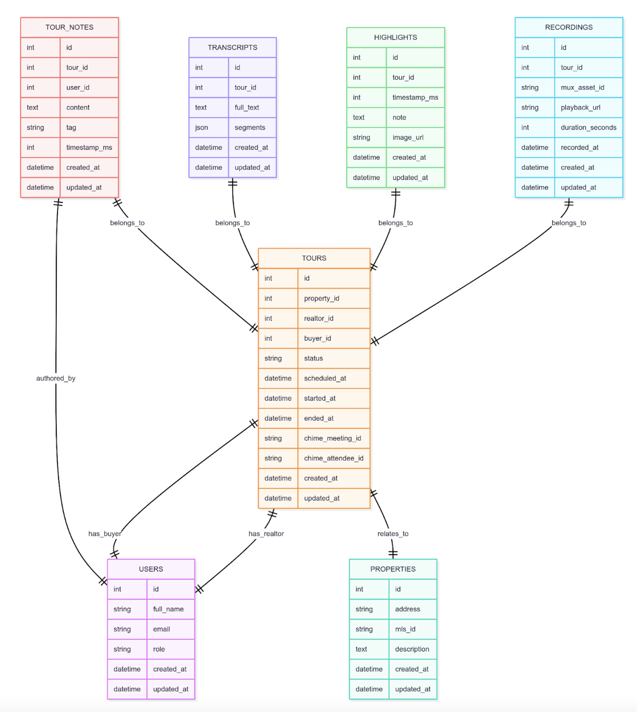

# RealtyForYou System Design

- [Systems Design - High Level](#systems-design---high-level)
    - [Gathering System Requirements](#gathering-system-requirements)
    - [Persistent Storage Solution and App Load](#persistent-storage-solution-and-app-load)
    - [Load Balancing](#load-balancing)
    - [Pub-Sub System for Real-Time Behavior](#pub-sub-system-for-real-time-behavior)
    - [Observability & Monitoring](#observability--monitoring)
    - [Security & Compliance](#security--compliance)
    - [Performance Benchmarks](#performance-benchmarks)

> **Note:** The Low Level section contains detailed technical components and provides a deep dive into the internal architecture of the video streaming system.

  - [Systems Design - Low Level](#systems-design---low-level)
    - [Gathering System Requirements](#gathering-system-requirements)
    - [Actions](#actions)
    - [Coming Up With A Plan](#coming-up-with-a-plan)
    - [Technology & Framework Rationale](#technology-&-framework-rationale)
    - [Ruby on Rails + React + React Native + AWS Chime SDK](#nodejs---redis---socketio)
      - [How it works](#how-it-works)
    - [C4](#c4)
      - [System Context](#system-context)
      - [Container Diagram](#container-diagram)
        - [API Surface (REST)](#api-surface-rest)
      - [Component Diagram](#component-diagram)
        - [Code](#code)
    - [Rails API](#rails-api)
      - [Technologies](#technologies)
      - [API Surface (REST)](#api-surface-rest)
      - [Databases](#databases)
      - [Asynchronous Jobs](#asynchronous-jobs)
      - [Error Handling](#error-handling)
      - [MVC and Services](#mvc-and-services)
      - [Concerns](#concerns)
      - [Authorization & Security](#authorization--security)
      - [DevOps & CI/CD](#devops--ci-cd)
      - [Observability](#observability)
    - [React](#react)
      - [Technologies](#technologies)
      - [Design Patterns](#design-patterns)
      - [State Management](#state-management)
      - [Error Handling](#error-handling)
      - [API Integration Strategy](#api-integration-strategy)
      - [Testing Strategy](#testing-strategy)
      - [Styling & Theming](#styling--theming)
      - [Security](#security)
    - [React Native](#react-native)
      - [Technologies](#technologies)
      - [Design Patterns](#design-patterns)
      - [State Management](#state-management)
      - [Error Handling](#error-handling)
      - [Offline Support & Sync](#offline-support--sync)
      - [Video Streaming & SDK Integration](#video-streaming--sdk-integration)
      - [Testing Strategy](#testing-strategy)
      - [Permissions & Device APIs](#permissions--device-apis)
      - [Deep Linking & Navigation](#deep-linking--navigation)
      - [Security](#security)
    - [Tests and Delivery Automation](#tests-and-delivery-automation)
    - [Docker](#docker)

### Systems Design - High Level

#### Gathering System Requirements

**Functional Requirements:**
- User authentication and authorization
- Real-time video communication
- Property listing and search
- Appointment scheduling
- Call recording and playback

**Non-Functional Requirements:**
- High availability (99.9% uptime)
- Low latency (< 200ms)
- Scalability to 10,000 concurrent users
- Security and data privacy compliance

#### Technology & Framework Rationale

| Layer                      | Choice                              | Reason                                                                 |
|----------------------------|-------------------------------------|------------------------------------------------------------------------|
| Video                      | AWS Chime SDK                       | 2-way WebRTC, low-latency, cost-effective, SDK works on mobile         |
| Recording / Playback       | AWS MediaConvert                    | Recordings are stored and streamed with low ops burden     |                     
| API                        | Ruby on Rails (on AWS ECS/Fargate)  | Rapid development, team familiarity, rich gem ecosystem                |
| Mobile App                 | React Native                        | Realtor already has iOS/Android apps—build on top of them              |
| Storage                    | Postgres RDS                        | Great for relational joins (buyers, tours, highlights)                 |
| Observability              | CloudWatch Agent + Fluent Bit on ECS| Logs, metrics, health checks                                           |
| Transcription & Notes (P2) | AWS Transcribe + LLM summarizer     | Enables AI-enhanced summaries and note generation later                |

#### Persistent Storage Solution and App Load

**Database Design:**
- **PostgreSQL**: User data, property listings, appointments

- **Redis**: Session management, caching, real-time data
- **S3**: File storage for images and recordings
- **CloudFront**: CDN for static assets

**Data Flow:**
1. User requests → Load Balancer
2. Load Balancer → Application Servers
3. Application Servers → Database/Cache
4. Response → User through CDN

#### Load Balancing

| Component | Description |
|-----------|-------------|
| **Application Load Balancer (ALB)** | Route traffic to healthy instances |
| **Auto Scaling Group** | Automatically adjust capacity based on demand |
| **Health Checks** | Monitor instance health and remove unhealthy ones |
| **Session Affinity** | Maintain user sessions across requests |

#### Pub-Sub System for Real-Time Behavior

| Component | Description |
|-----------|-------------|
| **Redis Pub/Sub** | Real-time notifications and updates |
| **WebSocket Connections** | Persistent connections for live updates |
| **Event-Driven Architecture** | Decoupled services communication |
| **Message Queues** | Asynchronous processing of heavy tasks |

#### Observability & Monitoring

| Tool | Purpose |
|------|---------|
| **CloudWatch** | AWS native monitoring and logging |
| **DataDog** | Application performance monitoring |
| **Sentry** | Error tracking and performance monitoring |
| **Custom Dashboards** | Business metrics and KPIs |

#### Security & Compliance

| Security Measure | Description |
|-----------------|-------------|
| **Authentication** | JWT tokens with refresh mechanism |
| **Authorization** | Role-based access control (RBAC) |
| **Data Encryption** | TLS for data in transit, AES for data at rest |
| **API Security** | Rate limiting, input validation, CORS |

| Compliance Standard | Description |
|-------------------|-------------|
| **GDPR** | Data privacy and user consent |
| **SOC 2** | Security controls and audit trails |
| **Real Estate Regulations** | Industry-specific compliance |

#### Performance Benchmarks

| Metric | Target |
|--------|--------|
| **API Response Time** | < 200ms (95th percentile) |
| **Video Call Latency** | < 150ms |
| **Page Load Time** | < 3 seconds |
| **Database Query Time** | < 100ms |

### Systems Design - Low Level

#### Gathering System Requirements

**Detailed Requirements Analysis:**
- **User Stories**: Detailed breakdown of user interactions
- **Technical Specifications**: API contracts and data models
- **Integration Requirements**: Third-party service integrations
- **Performance Requirements**: Specific latency and throughput targets

#### Actions

**Core Actions:**
- **User Management**: Registration, authentication
- **Video Communication**: Call initiation, management, and termination
- **Property Management**: Listing creation, updates, and search
- **Appointment Scheduling**: Booking and calendar integration

#### Coming Up With A Plan

**Implementation Strategy:**
- **Phase 1**: Core video calling functionality
- **Phase 2**: Property management features
- **Phase, 3**: Advanced features and optimizations

#### Ruby on Rails + React + React Native + AWS Chime SDK

**Technology Stack:**
- **Backend**: Ruby on Rails 7 with API mode
- **Frontend Web**: React 18 with TypeScript
- **Mobile**: React Native with Expo
- **Video**: AWS Chime SDK for JavaScript and React Native

##### How it works

**Architecture Flow:**
| Step | Component | Description |
|------|-----------|-------------|
| 1 | **Client Request** | React/React Native app makes API call |
| 2 | **API Gateway** | Rails API receives and validates request |
| 3 | **Business Logic** | Rails controllers and services process request |
| 4 | **Video Service** | AWS Chime SDK handles video communication |
| 5 | **Database** | PostgreSQL stores persistent data |
| 6 | **Cache** | Redis provides fast access to frequently used data |
| 7 | **Response** | JSON response sent back to client |

#### C4

##### System Context

| Category | Components |
|----------|------------|
| **External Users** | Realtors and clients |
| **External Systems** | Email services |
| **Internal Systems** | Video platform, property database, user management |

##### Container Diagram

| Container | Description |
|-----------|-------------|
| **Web Application** | React SPA served by CDN |
| **Mobile Application** | React Native app distributed via app stores |
| **API Gateway** | Rails API handling all requests |
| **Video Service** | AWS Chime SDK for video communication |
| **Database** | PostgreSQL for persistent storage |
| **Cache** | Redis for session and cache data |
| **File Storage** | S3 for images and recordings |

###### API Surface (REST)

| API Type | Description |
|----------|-------------|
| **REST Endpoints** | CRUD operations for resources |
| **WebSocket** | Real-time updates and notifications |
| **File Upload** | Multipart form data for images and videos |

##### Component Diagram

| Component | Description |
|-----------|-------------|
| **Controllers** | Handle HTTP requests and responses |
| **Services** | Business logic and external integrations |
| **Models** | Data models and database interactions |
| **Serializers** | JSON response formatting |

| Component | Description |
|-----------|-------------|
| **JWT Service** | Token generation and validation |
| **OAuth Integration** | Social login providers |
| **Password Management** | Secure password handling |
| **Session Management** | User session tracking |
| **Call Management** | Video call lifecycle management |
| **Recording Service** | Call recording and storage |
| **Quality Control** | Video quality monitoring and adjustment |
| **Analytics** | Call metrics and user behavior tracking |

##### Code

| Aspect | Description |
|--------|-------------|
| **Modular Structure** | Clear separation of concerns |
| **Service Objects** | Business logic encapsulation |
| **Concerns** | Shared functionality across models |
| **Factories & Fixtures** | Reusable test data for users, properties, bookings |
| **Tests** | Comprehensive unit, integration, and end-to-end coverage for auth, property CRUD, booking flow, dashboards, analytics events, and background jobs |

### Rails API

Check more information about the [Backend Architecture here](./BACKEND_ARCHITECTURE.md).

#### Technologies

| Technology | Description |
|------------|-------------|
| **Ruby on Rails 7** | Web framework with API mode |
| **PostgreSQL** | Primary database |
| **Redis** | Caching and session storage |
| **JWT** | Authentication tokens |

#### API Surface (REST)

[Interface job examples](./rails-api/routes.rb)

| Endpoint | Method | Description |
|----------|--------|-------------|
| `/api/v1/auth/register` | POST | User registration |
| `/api/v1/auth/login` | POST | User authentication |
| `/api/v1/auth/password-reset/request` | POST | Trigger reset e-mail/SMS |
| `/api/v1/auth/password-reset/confirm` | POST | Complete password reset |
| `/api/v1/users/:id` | GET | User profile |
| `/api/v1/users/:id` | PATCH | Update user profile |
| `/api/v1/properties` | GET | List properties with filters |
| `/api/v1/properties` | POST | Create property (realtor) |
| `/api/v1/properties/:id` | GET | Get property details |
| `/api/v1/properties/:id` | PATCH | Update property |
| `/api/v1/properties/:id` | DELETE | Delete property |
| `/api/v1/bookings` | GET | List user bookings |
| `/api/v1/bookings` | POST | Schedule tour booking |
| `/api/v1/bookings/:id` | GET | Get booking details |
| `/api/v1/bookings/:id` | PATCH | Reschedule booking |
| `/api/v1/bookings/:id` | DELETE | Cancel booking |
| `/api/v1/dashboards/realtor` | GET | Realtor dashboard metrics & upcoming tours |
| `/api/v1/dashboards/buyer` | GET | Buyer dashboard upcoming & history |
| `/api/v1/analytics/realtor` | GET | Realtor analytics dashboard data |
| `/api/v1/calls` | POST | Create video call (tour) |
| `/api/v1/calls/:id` | GET | Get call details |
| `/api/v1/calls/:id/join` | POST | Join video call |
| `/api/v1/calls/:id/end` | POST | End video call |
| `/api/v1/upload/images` | POST | Upload property images |
| `/api/v1/upload/recordings` | POST | Upload call recordings |

#### Databases

[Interface job examples](./rails-api/models.rb)

| Table | Description |
|-------|-------------|
| **Users Table** | User profiles and authentication (id, full_name, email, role, password_digest, timestamps) |
| **PasswordResetTokens Table** | One-time reset tokens (user_id, token, expires_at, used_at) |
| **Properties Table** | Property listings and details (realtor_id, address, mls_id, description, timestamps) |
| **Bookings Table** | Tour booking requests (buyer_id, property_id, scheduled_at, status, timestamps) |
| **Tours Table** | Actual tour sessions (property_id, realtor_id, buyer_id, status, scheduled_at, started_at) |
| **Calls Table** | Video call sessions (tour_id, chime_meeting_id, status, started_at, ended_at) |
| **TourNotes Table** | User-generated notes during tours (tour_id, user_id, content, tag, timestamp_ms, timestamps) |
| **Transcripts Table** | AI-generated call transcripts (tour_id, full_text, segments JSON, timestamps) |
| **Highlights Table** | Tour highlights and moments (tour_id, timestamp_ms, note, image_url, timestamps) |
| **Recordings Table** | Call recordings and playback (tour_id, mux_asset_id, playback_url, duration_seconds, recorded_at, timestamps) |
| **AuditLogs Table** | Immutable system & user actions for compliance (actor_id, action, target_id, meta, created_at) |

#### Asynchronous Jobs

[Interface job examples](./rails-api/jobs.rb)

| Job Type | Description |
|----------|-------------|
| **Email Notifications** | Appointment reminders **and password-reset emails** |
| **Booking Reminder Job** | Send reminders & push notifications X minutes before a tour |
| **Tour Lifecycle Management** | Auto-start tours, send notifications when tours begin/end |
| **Video Processing** | Recording compression and storage |
| **Transcription Processing** | Process audio recordings → AWS Transcribe → store in Transcripts table |
| **Highlight Generation** | AI-powered tour highlight detection and image capture |
| **Tour Summary Generation** | Create AI summaries from transcripts and notes |
| **Recording Cleanup** | Archive old recordings based on retention policies |
| **Dashboard Aggregation** | Nightly roll-up of metrics into AnalyticsAggregates |
| **Analytics Ingestion** | Stream events → warehouse (e.g., Snowflake/Kinesis) |
| **Property Image Processing** | Resize/compress images on upload |
| **Data Sync** | External service synchronization |
| **Audit Log Processing** | Batch process audit events for compliance reporting |

#### Error Handling

| Component | Description |
|-----------|-------------|
| **Global Exception Handler** | Centralized error processing |
| **Custom Error Classes** | Domain-specific errors |
| **Error Logging** | Structured error logging |
| **Client Error Responses** | User-friendly error messages |

#### MVC and Services

| Layer | Description | Examples |
|-------|-------------|----------|
| **Models** | Data validation and business rules | [Model examples](./rails-api/models.rb) |
| **Views** | JSON response formatting | - |
| **Controllers** | Request handling and routing | [Model examples](./rails-api/controllers.rb) |
| **Services** | Complex business logic | [Model examples](./rails-api/services.rb) |

#### Concerns

| Concern | Description |
|---------|-------------|
| **Authentication** | User authentication and authorization |
| **Caching** | Response caching strategies |
| **Logging** | Request and response logging |
| **Validation** | Input validation and sanitization |

#### Authorization & Security

| Security Measure | Description |
|-----------------|-------------|
| **JWT Authentication** | Secure token-based authentication |
| **Role-Based Access** | User permission management |
| **API Rate Limiting** | Request throttling |
| **Input Validation** | SQL injection and XSS prevention |

#### DevOps & CI/CD

| Component | Description |
|-----------|-------------|
| **GitHub Actions** | Automated testing and deployment |
| **Docker** | Containerized application deployment |
| **AWS ECS** | Container orchestration |
| **Blue-Green Deployment** | Zero-downtime deployments |

| Consideration | Description |
|---------------|-------------|
| **Infrastructure as Code (IaC)** | Terraform modules provision VPCs, ECS clusters, RDS, and S3 buckets |
| **Branching Strategy** | Trunk-based development with short-lived feature branches; protected `main` branch with required status checks |
| **Environment Strategy** | Isolated **dev**, **staging**, and **production** accounts; feature flags for risky features |
| **Secrets Management** | AWS Secrets Manager and SSM Parameter Store; rotation policies for DB and JWT secrets |
| **Rollback & Release** | Blue-green by default; canary releases for high-risk changes; one-click rollback via ECS task definition history |
| **CI Quality Gates** | Linting, tests, security scans (Snyk) must pass before merge |

#### Observability  

| Component | Description |
|-----------|-------------|
| **Key Metrics** | API p95 latency, video call setup time, Chime meeting duration, error rates, CPU/Memory of ECS tasks |
| **Dashboards** | Real-time Grafana dashboards for business KPIs (tours per day) and system KPIs |
| **Alerting** | PagerDuty integration; SLO-based alerts (e.g., >1% error rate for 5 min) route to on-call engineer |
| **Synthetic Checks** | CloudWatch Synthetics canaries hit critical endpoints every minute |
| **Log Aggregation** | Fluent Bit ships JSON logs to CloudWatch Logs and DataDog for correlation |

#### Scalability & Availability

| Aspect | Description |
|--------|-------------|
| **Target Scale** | 10 k concurrent users / 500 simultaneous video tours in MVP phase |
| **Multi-AZ Deployment** | ECS services span at least 2 AZs; RDS in Multi-AZ mode with automatic fail-over |
| **Auto-Scaling** | ALB request count and custom Chime metrics drive ECS task scaling |
| **Read Replicas & Caching** | Add RDS read replicas and Redis caching tier when read QPS > 2 k |
| **Disaster Recovery** | Daily RDS snapshots (retain 7 days) + S3 cross-region replication; RTO < 60 min, RPO < 15 min |

#### Security & Compliance

| Security Measure | Description |
|-----------------|-------------|
| **Data Classification** | User PII, recordings, and transcripts stored in encrypted S3 buckets (SSE-KMS) |
| **Vulnerability Management** | Weekly Snyk scans; monthly dependency upgrades |
| **Pen-Testing** | External penetration test prior to launch and annually thereafter |
| **Incident Response** | Runbooks in OpsGenie; post-mortems within 48 h |
| **Logging & Audit** | CloudTrail enabled for all accounts; immutable logs stored in Glacier |

**API Documentation & Tooling:**
| Tool | Description |
|------|-------------|
| **OpenAPI (Swagger)** | Auto-generated YAML spec from Rails controllers; hosted at `/docs` |
| **Postman Collection** | Exported nightly via CI; shared with frontend & partners |
| **SDKs** | OpenAPI generator produces TypeScript / Ruby SDKs for consumers |

#### User Roles & Permissions

| Role      | Description                               | Key Permissions                                             |
|-----------|-------------------------------------------|-------------------------------------------------------------|
| Buyer     | End-user interested in properties         | View listings, request tours, join video calls              |
| Realtor   | Property owner/agent                      | Create/update listings, host video calls, view analytics    |
| Admin     | Internal operations/support               | Manage users & listings, view all analytics, system settings|
| System    | Background jobs & services                | Recording processing, analytics aggregation                 |

Role-based access control (RBAC) is enforced via **Pundit** policies in Rails and JWT claims on the client side.

### React

Check more information about the [React Architecture here](./FRONTEND_ARCHITECTURE.md).

#### Technologies

| Technology | Description |
|------------|-------------|
| **React 18** | UI library with hooks |
| **TypeScript** | Type-safe JavaScript |
| **Vite** | Fast build tool and dev server |
| **Tailwind CSS** | Utility-first CSS framework |
| **React Query** | Server state management |

#### Design Patterns

| Pattern | Description |
|---------|-------------|
| **Component Composition** | Reusable component design |
| **Custom Hooks** | Shared logic extraction |
| **Context API** | Global state management |
| **Render Props** | Flexible component patterns |

#### State Management

| Strategy | Description |
|----------|-------------|
| **React Query** | Server state and caching |
| **Context API** | Global application state |
| **Local State** | Component-specific state |
| **URL State** | Navigation and routing state |

#### Error Handling

| Component | Description |
|-----------|-------------|
| **Error Boundaries** | Component error isolation |
| **Toast Notifications** | User-friendly error messages |
| **Retry Mechanisms** | Automatic retry for failed requests |
| **Fallback UI** | Graceful degradation |

#### API Integration Strategy

| Strategy | Description |
|----------|-------------|
| **Axios** | HTTP client with interceptors |
| **WebSocket** | Real-time updates |
| **Request Caching** | Optimistic updates and caching |
| **File Upload** | Multipart form data handling |

#### Testing Strategy

| Test Type | Framework |
|-----------|-----------|
| **Jest** | Unit testing framework |
| **React Testing Library** | Component testing |
| **Cypress** | End-to-end testing |
| **MSW** | API mocking for tests |

#### Styling & Theming

| Approach | Description |
|----------|-------------|
| **Tailwind CSS** | Utility-first styling |
| **CSS Modules** | Component-scoped styles |
| **Design System** | Consistent component library |

#### Security

| Security Measure | Description |
|-----------------|-------------|
| **XSS Prevention** | Input sanitization |
| **CSRF Protection** | Cross-site request forgery prevention |
| **Content Security Policy** | Resource loading restrictions |
| **HTTPS** | Secure communication |

### React Native

Check more information about the [React Native architecture here](./MOBILE_ARCHITECTURE.md)

#### Technologies

| Technology | Description |
|------------|-------------|
| **React Native** | Cross-platform mobile development |
| **Expo** | Development platform and tools |
| **TypeScript** | Type-safe development |
| **React Navigation** | Navigation library |

#### Mobile Design Patterns

| Pattern | Description |
|---------|-------------|
| **Platform-Specific Components** | Native look and feel |
| **Responsive Design** | Adaptive layouts |
| **Offline-First** | Local data persistence |
| **Push Notifications** | Real-time updates |

#### Mobile State Management

| Strategy | Description |
|----------|-------------|
| **Redux Toolkit** | Predictable state management |
| **AsyncStorage** | Local data persistence |
| **Realm** | Local database for offline data |
| **State Synchronization** | Online/offline sync |

#### Mobile Error Handling

| Component | Description |
|-----------|-------------|
| **Crash Reporting** | Sentry integration |
| **Network Error Handling** | Offline mode support |
| **User Feedback** | Toast and alert notifications |

#### Offline Capabilities (Support & Sync)

| Capability | Description |
|------------|-------------|
| **Local Database** | Realm for offline data storage |
| **Queue System** | Offline action queuing |
| **Sync Engine** | Data synchronization when online |
| **Conflict Resolution** | Merge strategies for conflicts |

#### Video Streaming & SDK Integration

| Feature | Description |
|---------|-------------|
| **AWS Chime SDK** | Native video calling |
| **Adaptive Quality** | Dynamic video quality adjustment |
| **Background Mode** | Call continuation in background |

#### Mobile Testing Strategy

| Test Type | Framework |
|-----------|-----------|
| **Jest** | Unit testing |
| **Detox** | End-to-end testing |
| **Device Testing** | Real device testing |
| **Performance Testing** | Memory and battery optimization |

#### Permissions & Device APIs Integration

| Permission | Purpose |
|------------|---------|
| **Camera Access** | Video call permissions |
| **Microphone Access** | Audio permissions |
| **Location Services** | Property proximity features |
| **Push Notifications** | Real-time alerts |

#### Deep Linking & Navigation

| Feature | Description | Priority |
|---------|-------------|----------|
| **Deep Links** | Direct navigation to specific content | Phase 2 |
| **Universal Links** | iOS deep linking | Phase 2 |
| **App Links** | Android deep linking | Phase 2 |
| **Navigation State** | Persistent navigation state | Phase 2 |

**Note:** Deep linking is a user experience enhancement for property sharing and tour invitations. Not required for MVP but recommended for Phase 2 to improve user engagement and lead generation.

### Tests and Delivery Automation

| Test Type | Description |
|-----------|-------------|
| **Unit Tests** | Individual component testing |
| **Integration Tests** | API and service testing |
| **End-to-End Tests** | Complete user journey testing |
| **Performance Tests** | Load and stress testing |

| Pipeline Component | Description |
|-------------------|-------------|
| **CI/CD** | Automated testing and deployment |
| **Code Quality** | Automated linting and formatting |
| **Security Scanning** | Automated vulnerability detection |
| **Performance Monitoring** | Automated performance testing |

### Docker

| Aspect | Description |
|--------|-------------|
| **Multi-stage Builds** | Optimized image creation |
| **Environment Configuration** | Environment-specific settings |
| **Service Orchestration** | Docker Compose for local development |
| **Production Deployment** | Containerized production deployment |
