# RealtyForYou System Design

This document provides an overview of the RealtyForYou platform architecture, focusing on system context, main components, data flow, and integration points. For detailed technology, implementation, and code, see the dedicated architecture documents for each subsystem.

---

RealtyForYou is a cloud-native platform for virtual real estate tours, enabling realtors and buyers to connect via live video, manage properties, and schedule appointments. The system is designed for high availability, scalability, and security, leveraging AWS-managed services and a modular architecture.

<strong>Database Diagram</strong>

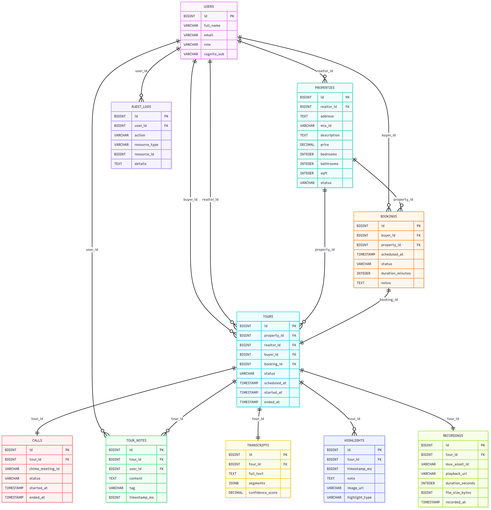

This data model represents a virtual real estate platform where buyers and realtors engage in property tours, primarily through scheduled video calls. At the core is the TOURS table, which connects buyers, realtors, properties, and bookings, serving as the high-level abstraction of a tour. Supporting this, the USERS, PROPERTIES, and BOOKINGS tables define the core entities of the platform, capturing who is involved, what property is being toured, and when. Tours are enriched with associated content like TOUR_NOTES, TRANSCRIPTS, HIGHLIGHTS, and RECORDINGS, offering a complete view of the experience, from user notes and AI-generated summaries to media artifacts and general web analytics. AUDIT_LOGS capture user actions for transparency and compliance.

Three separate tables support different layers of the tour experience. TOURS represents the business-level concept — the scheduled and completed interaction between buyer and realtor for a property. CALLS tracks the technical execution of the video session (e.g., meeting IDs, status, connection times), allowing multiple calls per tour if needed. Meanwhile, RECORDINGS manages the media files generated from these calls, enabling playback, storage, and post-processing. This separation of concerns — business abstraction (tours), technical events (calls), and persistent artifacts (recordings) — provides flexibility, auditability, and scalability, making the system robust enough to handle both real-time and asynchronous use cases.

<strong>Data Flow & Integration</strong>

1. **User requests** (web/mobile) are routed via AWS ALB to the Rails API.
2. **Authentication** is managed by AWS Cognito. The Rails API verifies Cognito tokens on each request and handles authorization, business logic, and data access (Postgres, Redis).
3. **Video tours** are powered by AWS Chime SDK, orchestrated by the backend, and joined by clients via SDKs.
4. **Media (images, recordings)** are stored in S3 and delivered via CloudFront.
5. **Notifications, analytics, and background jobs** are managed by backend services and AWS integrations.

<strong>C4</strong>

[C4 (Context, Container, Component, and Code)](https://c4model.com/) is a visual modeling framework for software architecture developed by Simon Brown. It provides a clear, hierarchical way to describe and communicate software system designs, starting with a high-level system context (C1), zooming into containers like web apps and databases (C2), then detailing components within those containers (C3), and finally, optionally, drilling down to code-level structures like classes and interfaces (C4).

<strong>Context</strong>

> Context describes the stakeholders (users) that interact with the companies that can interact with other companies due to integrations.

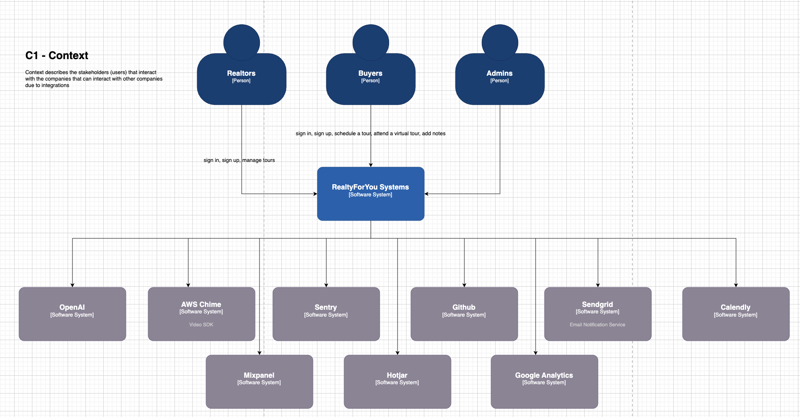

<strong>Containers</strong>

> Containers are the applications/servers/systems that a company has (Frontend, backend, mobile, etc).

### Mobile App

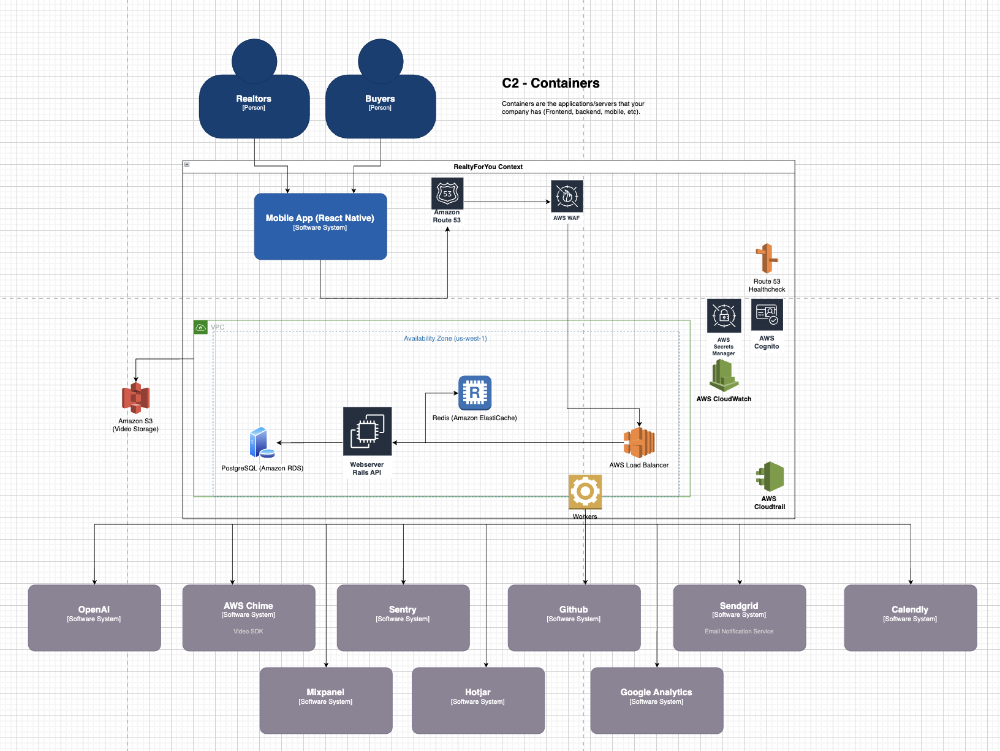

### Web App

<strong>Components + Code</strong>

> The Component level zooms into a single container (e.g., the backend Rails API) and identifies the key logical components—like controllers, services, repositories, and background jobs—and how they collaborate to fulfill user needs.

> The Code level goes even deeper, drilling into the implementation details of an individual component. This could mean viewing how PropertyPublishingService#publish validates input, handles edge cases, or calls out to infrastructure (e.g., Redis, Sidekiq, or Chime SDK).

<strong>Backend Components</strong>

> Note that the controllers are missing the Api::V1:: in the diagram below, because draw.io does not allow me to resize the objects, therefore many names were broken and it was better to keep without it.

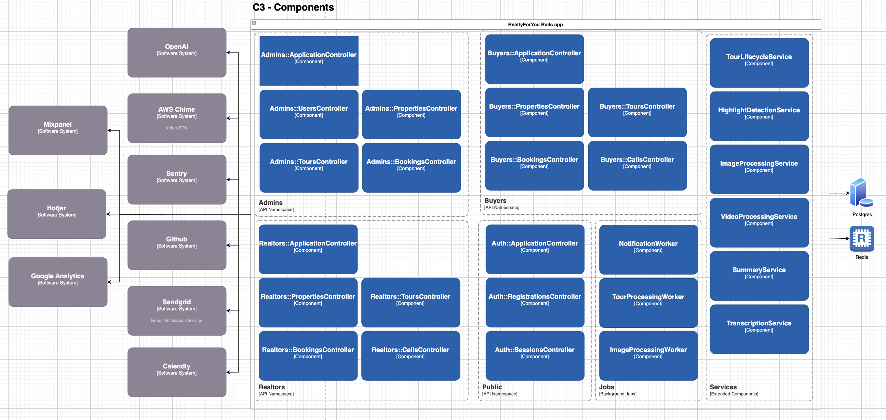

<strong>Admin API namespace</strong>

### Property Endpoints

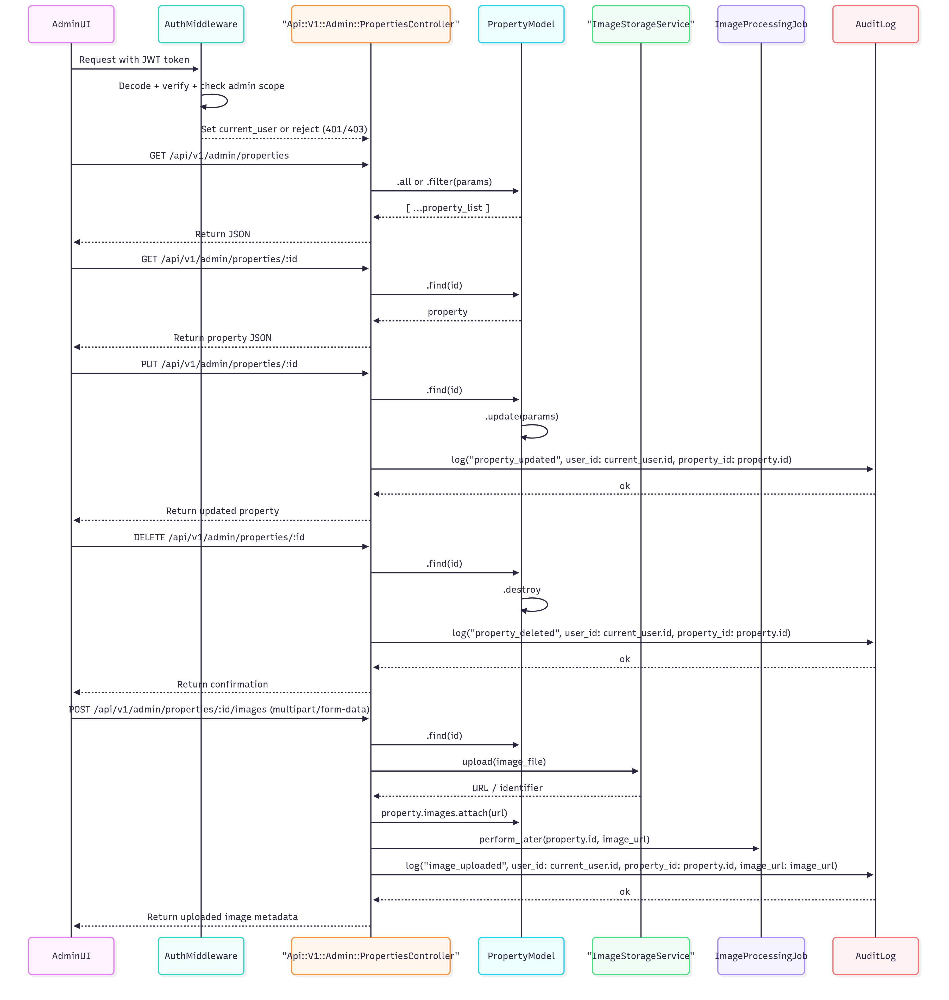

### Booking Endpoints

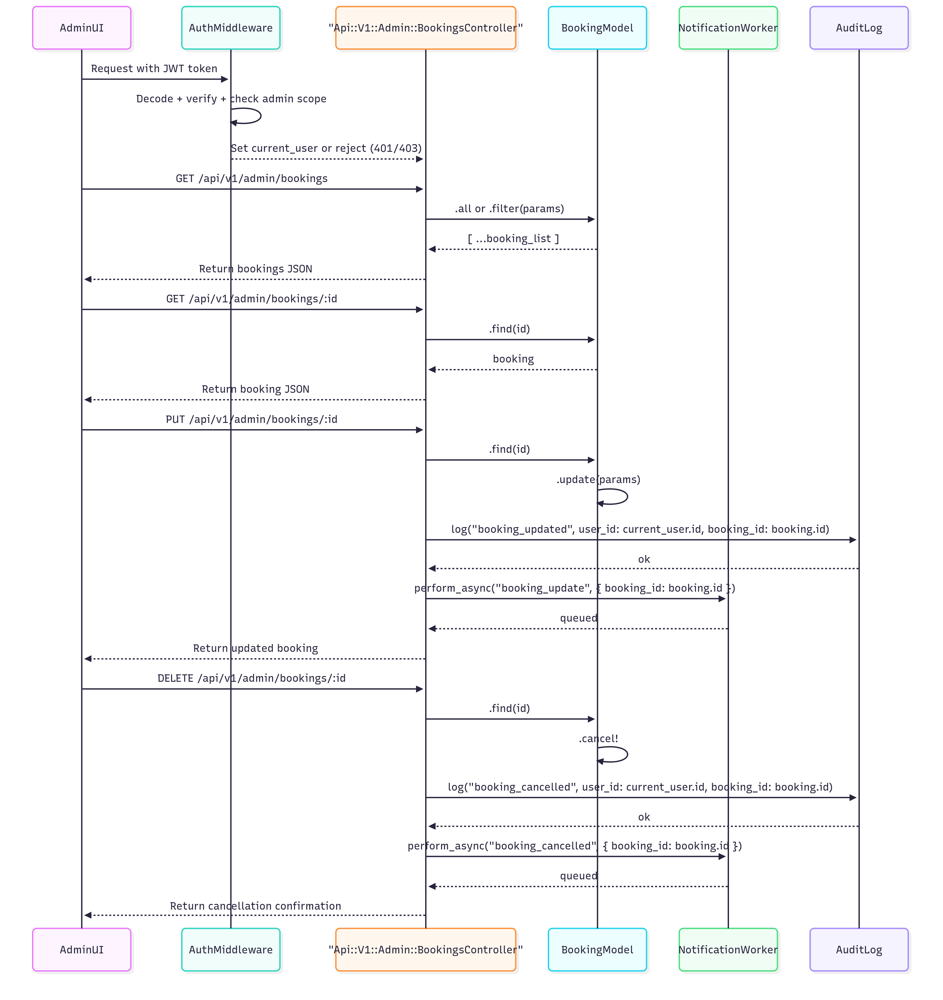

### Tour Endpoints

### User Endpoints

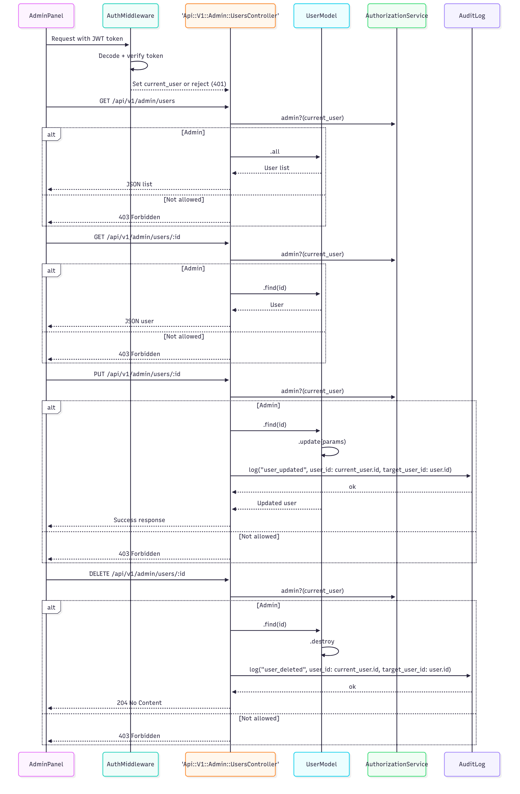

<strong>Buyers API namespace</strong>

### Property Browsing Endpoints

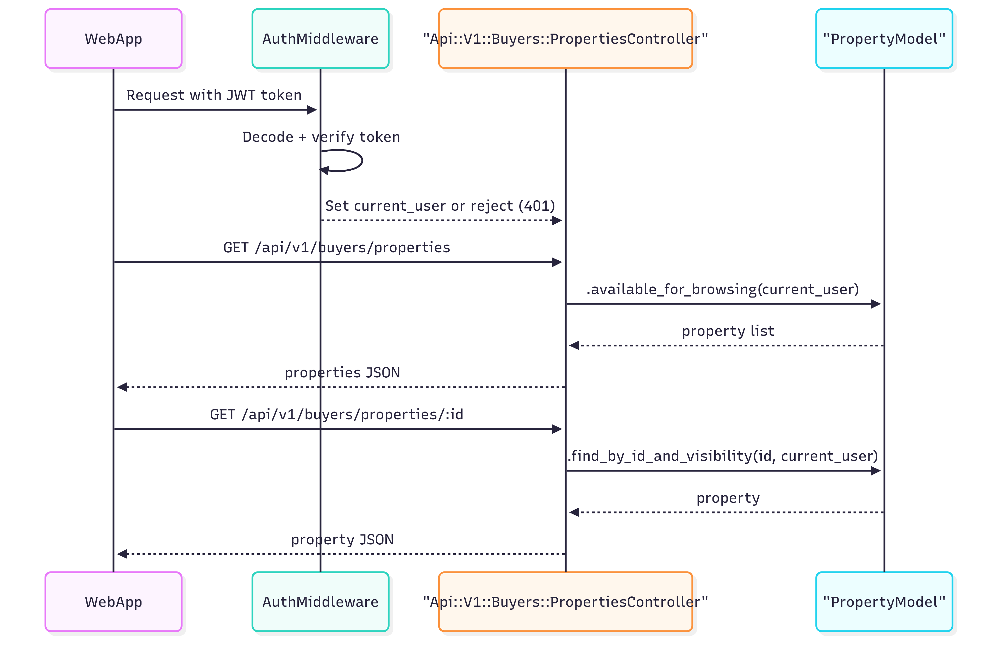

### Booking Endpoints

### Calls Endpoints

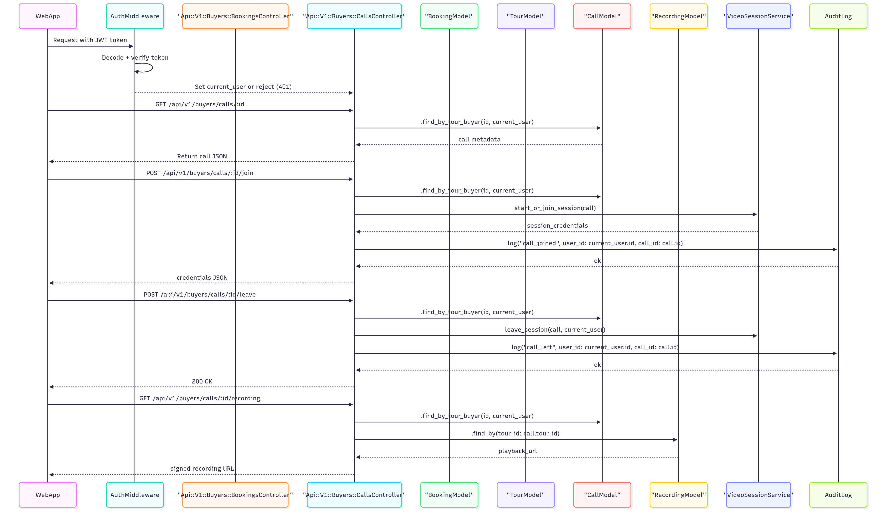

### Tour Participation Endpoints

<strong>Realtors API namespace</strong>

### Properties Endpoints

### Booking Endpoints

### Calls Endpoints

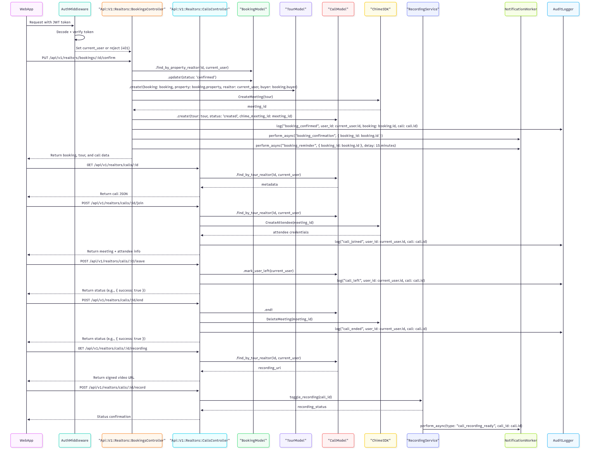

### Tour Endpoints

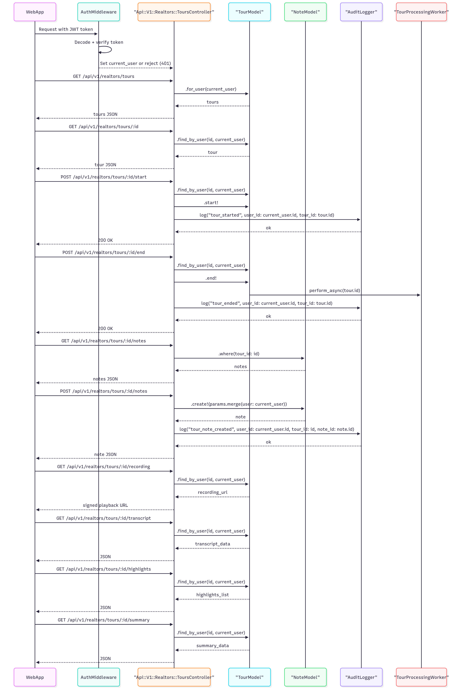

### Post-Tour

<strong>Main Applications</strong>

Below you can find some **extra work** about the applications where I bring proposed discussions about the project features.

| Applications | Description | Additional low level details about the application  |
|-------------------|------------------------------------------------------------------|---------------------------------------------------|
| **Frontend (Web)**| React SPA for user interaction, property browsing, and tours     | [FRONTEND_ARCHITECTURE.md](architecture/FRONTEND_ARCHITECTURE.md) |
| **Mobile App**    | React Native app for mobile tour participation                   | [MOBILE_ARCHITECTURE.md](architecture/MOBILE_ARCHITECTURE.md)     |
| **Backend API**   | Ruby on Rails API for business logic, data, and integrations     | [BACKEND_ARCHITECTURE.md](architecture/BACKEND_ARCHITECTURE.md)   |
| **Infrastructure**| AWS-based, containerized, secure, and scalable cloud infra       | [INFRA_ARCHITECTURE.md](architecture/INFRA_ARCHITECTURE.md)       |

